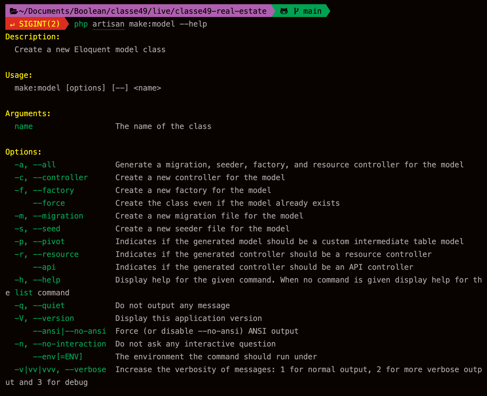

# Real Estate

## To do
1. DB  
   Houses
   - id | pk
   - name | varchar 60
   - description | text
   - address | varchar 60
   - city | varchar 100
   - rooms | tinyInt
   - mq | int
   - level | tinyInt
   - photo | varchar 255
   - is_rent | bool
   - is_sale | bool
   - price  | decimal
   - created_at
   - updated_at
2. Model  
House
create model

--all creates migration, model, seeder, factory, controller resources
`php artisan make:model --all`

1. Controller  
   HouseController

2. Migration  

3. Seed
   Avviamo i nostri seeder in massa con
   `php artisan db:seed`  
   `$this->call(HouseSeeder::class);` dentro DatabaseSeeder possiamo aggiungere i nostri seeder

   oppure chiamiamo direttamente il seeder specifico
   `php artisan db:seed --class=NomeSeeder`
   
